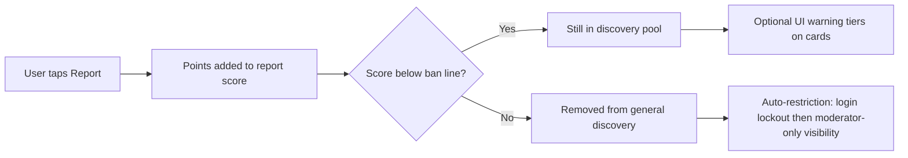

# User reporting — overview for product & business

This document explains **how user reporting works today** on the platform, in plain language. It is meant for product managers, trust & safety, operations, and anyone who does not read backend code.

Technical API details for engineers live in [for-frontend/FRONTEND_INTEGRATION.md](for-frontend/FRONTEND_INTEGRATION.md) (Report User section).

---

## What “reporting” means here

When someone taps **Report** on another user (on a face card, in a call, from offline cards, etc.), the platform does **not** simply count “one more report.” Instead it adds points to that person’s **report score** on their profile.

- Think of the report score as a **running total of seriousness**, not a headcount of how many people tapped Report.
- Different situations add **different amounts** of points (see weights below).
- When the score crosses a **ban line**, automated safety actions kick in.
- **Before** the ban line, discovery can still show the person but may flag their card with **warning tiers** so other users see that others have raised concerns.

Reporting is always about the **user account**, not a specific room, stream, or card instance. One report updates that person’s overall score everywhere.

---

## The journey in one picture

---

## How a single report is recorded

1. A signed-in user chooses **Report** and identifies **who** was reported.
2. The app may send **where** the report came from (optional `reportType`), for example:
   - Browsing a **face card** in discovery
   - An **offline card**
   - They were the **host** of a session
   - They were a **participant** (or participant acting as host)
   - No type specified → **default** weight
3. The backend adds the matching **weight** to the reported user’s **report score** (`reportCount` in the database — the name is historical; it is a **score**, not a raw count).
4. Safety logic runs immediately (discovery visibility, possible auto-ban, KYC risk if enabled).

Anyone authenticated can report someone else. Users **cannot** report themselves.

**Note:** The system does **not** currently block the same reporter from submitting multiple reports on the same person; each submission adds points again. Product should treat “Report” as intentional each time, or plan deduplication if abuse becomes an issue.

---

## Weighted scoring (why context matters)

Not every report is treated equally. Reports from **higher-trust or higher-stakes contexts** carry more weight by default.

| Context (`reportType`) | Typical meaning | Default weight (configurable) |
|------------------------|-----------------|-------------------------------|
| Default / unspecified | Generic report | 1 |
| Face card | Saw them in discovery swipe deck | 3 |
| Offline card | Report from offline card flow | 2 |
| Participant | In a session as participant | 5 |
| Host / participant host | Person was hosting (or equivalent) | 10 |

**Admin dashboard reports** (Beam / internal tools) use the **strongest** configured in-app weight, or a dedicated admin override — so a human moderator action counts as seriously as the worst in-app category, not as a single anonymous tap.

All of these numbers are **environment settings** (`REPORT_WEIGHT_*`). Operations can tune them without shipping new app code.

---

## The ban line (when automation steps in)

Each environment defines a **ban threshold** (`REPORT_THRESHOLD`, default **5**).

When a user’s **report score is at or above** that number:

1. **Discovery:** They are **hidden from the normal discovery pool** — regular users should not see their face cards in the main feed.
2. **Account:** An **automatic moderation ban** is applied (unless they were already manually banned for other reasons):
   - For a configurable period they **cannot sign in** (default **7 days**, `REPORT_BAN_LOGIN_BLOCK_DAYS`).
   - After that period they may sign in again, but discovery stays in a **restricted mode**: they only interact with **moderator** accounts until staff review or the score is lowered.
3. **KYC (if enabled):** Report score also feeds a **risk percentage** used for verification decisions (separate from discovery layers).

If the score is **lowered back below** the ban line (e.g. admin adjusts score), automatic report bans can be **lifted** and normal discovery rules apply again.

Manual bans by staff are respected: the system does not fight an intentional manual ban with report automation.

---

## Warning tiers on cards (before the ban line)

For users **still below** the ban threshold but with a non-zero score, discovery cards can show **how elevated** concern is using **report layers** 0–3:

| Layer | Meaning (plain language) |
|-------|---------------------------|
| **0** | Low or no accumulated concern (below first tier) |
| **1** | Mild — score crossed the first tier |
| **2** | Moderate |
| **3** | High — just under the ban line |

The exact score cutoffs for layers 1–3 are configurable (`DISCOVERY_REPORT_LAYER_1/2/3`). They are always kept **below** the ban threshold so the UI can warn users **before** someone disappears from the pool.

The app receives `reportLayer` and optional `reportLayerThresholds` on card payloads so UX can show badges, copy, or friction without guessing.

**Production vs staging:** If the ban threshold is low (e.g. 5 for testing), layer cutoffs are **scaled down automatically** so tiers still make sense. If the ban threshold is high (e.g. 50), defaults like 20 / 30 / 40 can be used for gradual warnings.

---

## Where reports can be filed

- **Universal in-app API:** `POST /users/report` (also exposed via API gateway and streaming service proxy).
- **Same behavior** from discovery, streaming, face cards, offline cards — one score, one enforcement pipeline.
- **Admin:** `POST /admin/users/:id/report` with reason/notes for audit; applies maximum weight.

---

## What this is *not*

- **Not** a case/ticket system with workflows, evidence upload, or chat transcripts in this repo path — those would be separate product surfaces.
- **Not** “X reports from X different users required” — there is no quorum rule in code today.
- **Not** a public leaderboard of report counts shown to end users by default — the score drives **internal** eligibility and optional **layer** UX on cards.

---

## “Weighted / graduated” reporting vs “absolute” reporting

**Absolute reporting** (common simple model):

- Every report = **+1**, regardless of who reported or where.
- Often: “**3 strikes and you’re out**” or a fixed number of reports → ban.
- Problems:
  - A coordinated pile-on from low-context taps counts the same as a host reporting serious behavior in a live session.
  - No gradation: users see nothing until someone suddenly vanishes, or everyone sees the same binary “reported” flag too early.
  - Hard to tune: changing “3” to “5” is blunt; changing weight by context is impossible without code changes.

**How this platform reports (weighted score + tiers + one ban line):**

| Idea | Benefit |
|------|---------|
| **Weighted points** | A report during hosting counts more than a quick card swipe — aligns punishment with **signal quality**. |
| **Single running score** | Ops tune **one threshold** and **weights**, not dozens of per-feature rules. |
| **Graduated UI layers** | Community sees **escalating caution** on cards before someone is removed — transparency without instant disappearance. |
| **One ban tripwire** | Clear, auditable moment when automation applies — score ≥ threshold. |
| **Reversible** | Admins can adjust score; automation can lift when score drops — supports appeals and false positives. |
| **Configurable** | Weights, threshold, layer cutoffs, and login lockout days change per environment without app releases. |

In short: **absolute reporting counts events; this system accumulates weighted trust-and-safety signal and acts in stages.**

---

## Configuration cheat sheet (for ops / product)

Discuss with engineering before changing production values.

| Setting | Role |
|---------|------|
| `REPORT_WEIGHT_*` | Points per report context |
| `REPORT_THRESHOLD` | Ban line (discovery removal + auto-moderation) |
| `DISCOVERY_REPORT_LAYER_1/2/3` | UI warning tier cutoffs (must stay below ban line) |
| `REPORT_BAN_LOGIN_BLOCK_DAYS` | Login lockout length after ban line |
| `REPORT_WEIGHT_ADMIN_DASHBOARD` | Optional fixed weight for admin reports |
| `DISCOVERY_POOL_EXCLUDE_AT_REPORT_THRESHOLD` | Set `false` only if you intentionally want banned-score users still queryable (e.g. staging) |
| `KYC_REPORT_NORM_FACTOR` / `KYC_RISK_THRESHOLD` | Maps score into KYC risk % when KYC automation is on |

---

## Suggested talking points for stakeholders

1. **Safety scales with context** — not every Report button press is equal.
2. **Users get warnings before removal** — layers on cards, then pool exclusion, then account restrictions.
3. **Moderators have a stronger lever** — dashboard reports hit maximum weight with reason/notes.
4. **Policy can evolve** — thresholds and weights are configuration, not buried in mobile releases.
5. **Tradeoff to know** — repeat reports from the same person still add points today; plan product UX (confirm dialogs, rate limits) if needed.

---

## Related technical docs

- [FRONTEND_INTEGRATION.md — Report User](for-frontend/FRONTEND_INTEGRATION.md)
- [OFFLINE_CARDS.md — report fields on cards](for-frontend/OFFLINE_CARDS.md)
