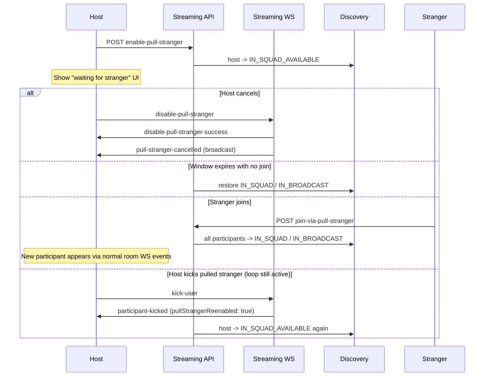
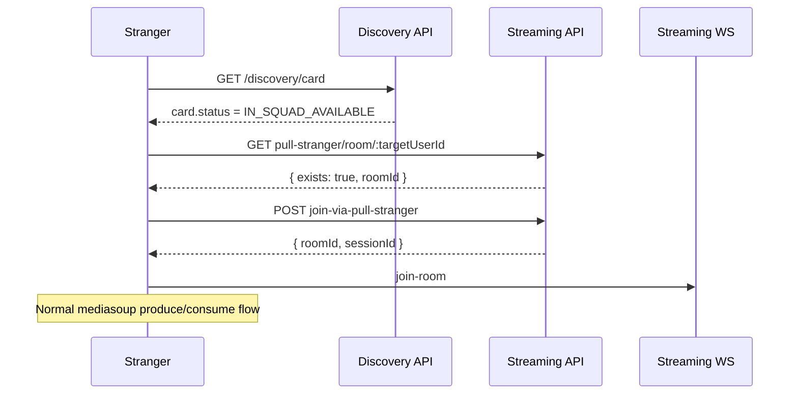

# Pull Stranger — Frontend Integration Guide

This document describes how the frontend should integrate **Pull Stranger**: a host in an active squad/broadcast call can summon a stranger from discovery to join the room directly (one-way acceptance, no mutual match flow).

It reflects backend changes from commits `722917e` through `631a07b` (May 2026):

- Cancel/disable endpoint (HTTP + WebSocket)
- Replacement loop after kick (auto re-enable pull stranger)
- Discovery visibility and eligibility filtering
- No `active_matches` / `MATCHED` flow for pull-stranger cards

All HTTP paths below assume API Gateway prefix `/v1` unless noted.

- **Base URL:** `API_BASE` (example: `https://api.example.com`)
- **Auth:** `Authorization: Bearer <access_token>` on gateway routes
- **WebSocket:** connect directly to streaming service (gateway does not proxy WS), e.g. `ws://localhost:3006/streaming/ws`

---

## 1) What Pull Stranger is

While users are in an active call (`IN_SQUAD` or `IN_BROADCAST`):

1. The **HOST** taps “Pull stranger”.
2. Backend opens a timed window (default **60s**, `PULL_STRANGER_WINDOW_MS`).
3. Only the **host who enabled** pull stranger becomes **`IN_SQUAD_AVAILABLE`** and can appear in discovery face cards.
4. Other participants stay **`IN_SQUAD`** (or **`IN_BROADCAST`**) and are **not** shown as pull-stranger cards.
5. A stranger browsing discovery sees the host’s card (`card.status === "IN_SQUAD_AVAILABLE"`).
6. Stranger accepts → joins the room via **`join-via-pull-stranger`** (not `POST /discovery/proceed`).
7. After one stranger joins, pull stranger mode turns off and all participants return to **`IN_SQUAD`** / **`IN_BROADCAST`**.

**Replacement loop:** If the host kicked a pulled-in stranger while the summoning loop is still active, backend auto re-enables pull stranger so a new stranger can be summoned. Users who already joined that session cannot see or rejoin the same pull-stranger call.

---

## 2) End-to-end flows

### 2.1 Host flow (in-call UI)



**Host steps:**

1. User must already be in a room as **HOST** (via normal squad/match flow + WebSocket `join-room`).
2. Call **`POST /v1/streaming/rooms/:roomId/enable-pull-stranger`**.
3. Show waiting/cancel UI until:
   - a stranger joins,
   - host cancels,
   - or the window expires.
4. To cancel while in the call, prefer WebSocket **`disable-pull-stranger`** (broadcasts to all participants). HTTP disable is also available.
5. Listen for **`participant-kicked`** — if `pullStrangerReenabled === true`, show “waiting for stranger” again.

### 2.2 Stranger flow (discovery UI)



**Stranger steps:**

1. **`GET /v1/discovery/card`** — card may have `"status": "IN_SQUAD_AVAILABLE"`.
2. **Do not call `POST /v1/discovery/proceed`** for these cards. Backend intentionally skips match creation for pull-stranger cards.
3. Resolve room id:
   **`GET /v1/streaming/pull-stranger/room/:targetUserId`**
   where `targetUserId` is the user id on the card.
4. Call **`POST /v1/streaming/rooms/:roomId/join-via-pull-stranger`** with `joiningUserId` (self) and `targetUserId` (card user).
5. Connect WebSocket and send **`join-room`** with returned `roomId`, then run normal mediasoup setup.

**Raincheck:** `POST /v1/discovery/raincheck` works the same as for normal cards.

---

## 3) API reference

### 3.1 Enable pull stranger (HOST only)

**`POST /v1/streaming/rooms/:roomId/enable-pull-stranger`**

Request:

```json
{
  "userId": "<host-user-id>"
}
```

Success (`200`):

```json
{
  "success": true,
  "message": "Pull stranger mode enabled"
}
```

Common errors:

| HTTP | Message | Meaning |
|------|---------|---------|
| 400 | Only HOST can enable pull stranger mode | Caller is not host |
| 400 | Room is full | Already at `MAX_PARTICIPANTS_PER_CALL` (default 4) |
| 400 | Pull stranger mode is already enabled | Wait for join/cancel/expiry before enabling again |
| 404 | Room not found | Invalid `roomId` |

**curl (via gateway):**

```bash
curl -sS -X POST "$API_BASE/v1/streaming/rooms/$ROOM_ID/enable-pull-stranger" \
  -H "Authorization: Bearer $ACCESS_TOKEN" \
  -H "Content-Type: application/json" \
  -d "{\"userId\":\"$HOST_USER_ID\"}"
```

**curl (local test endpoint, no auth):**

```bash
curl -sS -X POST "http://localhost:3006/streaming/test/rooms/$ROOM_ID/enable-pull-stranger" \
  -H "Content-Type: application/json" \
  -d "{\"userId\":\"$HOST_USER_ID\"}"
```

---

### 3.2 Disable / cancel pull stranger (HOST only)

**`POST /v1/streaming/rooms/:roomId/disable-pull-stranger`**

Request:

```json
{
  "userId": "<host-user-id>"
}
```

Success (`200`):

```json
{
  "success": true,
  "message": "Pull stranger mode disabled"
}
```

Idempotent: if pull stranger was already off, backend still restores participant statuses and logs a cancel event.

**curl (via gateway):**

```bash
curl -sS -X POST "$API_BASE/v1/streaming/rooms/$ROOM_ID/disable-pull-stranger" \
  -H "Authorization: Bearer $ACCESS_TOKEN" \
  -H "Content-Type: application/json" \
  -d "{\"userId\":\"$HOST_USER_ID\"}"
```

**curl (local test endpoint):**

```bash
curl -sS -X POST "http://localhost:3006/streaming/test/rooms/$ROOM_ID/disable-pull-stranger" \
  -H "Content-Type: application/json" \
  -d "{\"userId\":\"$HOST_USER_ID\"}"
```

**Preferred in-call cancel:** WebSocket message (see [§4 WebSocket](#4-websocket-messages)).

---

### 3.3 Resolve room for a visible pull-stranger user

**`GET /v1/streaming/pull-stranger/room/:userId`**

Used by the stranger client before join, and internally by discovery eligibility checks.

Response when active:

```json
{
  "exists": true,
  "roomId": "room-uuid"
}
```

Response when not summoning:

```json
{
  "exists": false
}
```

**curl:**

```bash
curl -sS "$API_BASE/v1/streaming/pull-stranger/room/$TARGET_USER_ID" \
  -H "Authorization: Bearer $ACCESS_TOKEN"
```

---

### 3.4 Check whether viewer can see a pull-stranger card

**`GET /v1/streaming/pull-stranger/room/:visibleUserId/eligibility/:joiningUserId`**

Discovery uses this internally. Frontend usually does not need it if you branch on `card.status`, but it is useful for debugging.

Response:

```json
{
  "exists": true,
  "eligible": true,
  "roomId": "room-uuid"
}
```

`eligible: false` when, for example, the viewer already participated in that pull-stranger session (even if kicked).

**curl:**

```bash
curl -sS "$API_BASE/v1/streaming/pull-stranger/room/$TARGET_USER_ID/eligibility/$JOINING_USER_ID" \
  -H "Authorization: Bearer $ACCESS_TOKEN"
```

---

### 3.5 Join room via pull stranger (stranger acceptance)

**`POST /v1/streaming/rooms/:roomId/join-via-pull-stranger`**

Request:

```json
{
  "joiningUserId": "<stranger-user-id>",
  "targetUserId": "<host-user-id-on-card>"
}
```

Success (`200`):

```json
{
  "success": true,
  "roomId": "room-uuid",
  "sessionId": "session-uuid",
  "message": "Successfully joined room via pull stranger"
}
```

Common errors:

| HTTP | Message | Meaning |
|------|---------|---------|
| 400 | Pull stranger mode is not enabled | Host did not enable or window expired |
| 400 | Pull stranger window has expired | Host must enable again |
| 400 | User … has already participated … cannot rejoin as a replacement | Prior participant in this session |
| 400 | User … is already in an active call | Joiner status is `IN_SQUAD` / `IN_BROADCAST` |
| 400 | Room is full | Capacity reached |
| 404 | Room not found | Invalid `roomId` |

**Allowed joiner statuses:** `AVAILABLE`, `IN_SQUAD_AVAILABLE`, `IN_BROADCAST_AVAILABLE`, `MATCHED` (transient during card render).

**curl (via gateway):**

```bash
curl -sS -X POST "$API_BASE/v1/streaming/rooms/$ROOM_ID/join-via-pull-stranger" \
  -H "Authorization: Bearer $ACCESS_TOKEN" \
  -H "Content-Type: application/json" \
  -d "{\"joiningUserId\":\"$JOINING_USER_ID\",\"targetUserId\":\"$TARGET_USER_ID\"}"
```

**curl (local test endpoint):**

```bash
curl -sS -X POST "http://localhost:3006/streaming/test/rooms/$ROOM_ID/join-via-pull-stranger" \
  -H "Content-Type: application/json" \
  -d "{\"joiningUserId\":\"$JOINING_USER_ID\",\"targetUserId\":\"$TARGET_USER_ID\"}"
```

After success, connect WebSocket and **`join-room`** (see [FRONTEND_INTEGRATION.md](./FRONTEND_INTEGRATION.md#1a-video-call-websocket-and-mediasoup)).

---

### 3.6 Discovery card (no separate endpoint)

Use existing **`GET /v1/discovery/card?sessionId=...`**.

Pull-stranger cards look like normal user cards but with:

```json
{
  "card": {
    "userId": "...",
    "status": "IN_SQUAD_AVAILABLE",
    "...": "..."
  }
}
```

**Frontend rule:** if `card.status === "IN_SQUAD_AVAILABLE"`, treat the primary CTA as **“Join call”** → streaming join flow above, **not** `POST /discovery/proceed`.

---

## 4) WebSocket messages

WebSocket URL: `ws://<streaming-host>/streaming/ws` with `Authorization: Bearer <token>` header.

### 4.1 Cancel pull stranger (host, in-call)

**Send:**

```json
{
  "type": "disable-pull-stranger",
  "data": {
    "roomId": "<room-id>"
  }
}
```

**Success to sender:**

```json
{
  "type": "disable-pull-stranger-success",
  "data": {
    "roomId": "<room-id>"
  }
}
```

**Broadcast to room:**

```json
{
  "type": "pull-stranger-cancelled",
  "data": {
    "roomId": "<room-id>",
    "cancelledBy": "<host-user-id>"
  }
}
```

Use **`pull-stranger-cancelled`** to dismiss “waiting for stranger” UI for all participants.

### 4.2 Kick with replacement loop

When host kicks a pulled-in stranger while the summoning loop is active, kick responses include:

**`participant-kicked` / `user-kicked-success`:**

```json
{
  "type": "participant-kicked",
  "data": {
    "roomId": "<room-id>",
    "kickedUserId": "<kicked-user-id>",
    "kickedBy": "<host-user-id>",
    "pullStrangerReenabled": true,
    "pullStrangerEnabledBy": "<host-user-id>"
  }
}
```

If `pullStrangerReenabled === true`, show summoning/waiting UI again. The host (`pullStrangerEnabledBy`) is back in discovery as `IN_SQUAD_AVAILABLE`.

**Send kick:**

```json
{
  "type": "kick-user",
  "data": {
    "roomId": "<room-id>",
    "targetUserId": "<participant-to-kick>"
  }
}
```

---

## 5) Status transitions (frontend expectations)

| Actor | When | Expected status |
|-------|------|-----------------|
| Host (enabler) | After enable | `IN_SQUAD_AVAILABLE` |
| Other participants | After enable | `IN_SQUAD` or `IN_BROADCAST` (unchanged visibility) |
| Stranger (joiner) | Before join | `AVAILABLE` / `IN_SQUAD_AVAILABLE` / `IN_BROADCAST_AVAILABLE` / transient `MATCHED` |
| Everyone in room | After successful join | `IN_SQUAD` or `IN_BROADCAST` |
| Everyone in room | After cancel / expiry | `IN_SQUAD` or `IN_BROADCAST` |
| Kicked stranger | After kick | `ONLINE` (or `AVAILABLE` if already in discovery pool) |

Refresh profile with **`GET /v1/me`** or your existing status polling after major transitions.

See also **[USER_STATUS_AND_APIS.md](./USER_STATUS_AND_APIS.md)**.

---

## 6) UI / product notes

1. **Single join per enable:** Only one stranger can join per enable cycle. After join, host must tap “Pull stranger” again for another stranger (unless kick auto re-enables the loop).
2. **Timed window:** Default 60s (`PULL_STRANGER_WINDOW_MS`). Show countdown on host waiting UI; on expiry, hide waiting state (host returns to normal in-call UI).
3. **Card copy:** Consider distinct CTA for `IN_SQUAD_AVAILABLE` cards (e.g. “Join their call”) vs normal match cards (“Meet this person”).
4. **No proceed:** Calling `POST /discovery/proceed` on pull-stranger cards does not create a match and is the wrong flow.
5. **Replacement eligibility:** Users who already joined (even if kicked) will not see that pull-stranger card again; discovery filters them server-side.
6. **Room full:** Enable fails when participant count is already at max (default 4).

---

## 7) Local manual test script

Set variables:

```bash
export API_BASE="http://localhost:3000"
export ROOM_ID="<active-room-id>"
export HOST_USER_ID="<host-id>"
export STRANGER_USER_ID="<stranger-id>"
export ACCESS_TOKEN="<jwt-if-using-gateway>"
```

1. Host enables:

```bash
curl -sS -X POST "http://localhost:3006/streaming/test/rooms/$ROOM_ID/enable-pull-stranger" \
  -H "Content-Type: application/json" \
  -d "{\"userId\":\"$HOST_USER_ID\"}"
```

2. Stranger resolves room:

```bash
curl -sS "http://localhost:3006/streaming/pull-stranger/room/$HOST_USER_ID"
```

3. Stranger joins:

```bash
curl -sS -X POST "http://localhost:3006/streaming/test/rooms/$ROOM_ID/join-via-pull-stranger" \
  -H "Content-Type: application/json" \
  -d "{\"joiningUserId\":\"$STRANGER_USER_ID\",\"targetUserId\":\"$HOST_USER_ID\"}"
```

4. Host cancels (HTTP):

```bash
curl -sS -X POST "http://localhost:3006/streaming/test/rooms/$ROOM_ID/disable-pull-stranger" \
  -H "Content-Type: application/json" \
  -d "{\"userId\":\"$HOST_USER_ID\"}"
```

Interactive HTML tester: `tests/html-interfaces/comprehensive-test-interface.html` (Pull Stranger Mode section).

---

## 8) Related docs

- **[FRONTEND_INTEGRATION.md](./FRONTEND_INTEGRATION.md)** — Discovery cards, WebSocket/mediasoup, streaming overview
- **[USER_STATUS_AND_APIS.md](./USER_STATUS_AND_APIS.md)** — `IN_SQUAD_AVAILABLE` and status checklist
